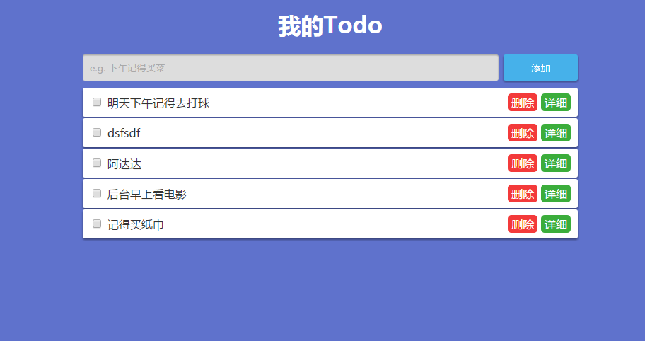

# MyTodoist
:clipboard:一个TODO应用

## Screenshot

## Features

- 添加
- 删除
- 显示详细任务
- 更新
- 标记完成状态
- 定时提醒

## Technical point

- 如何规划布局及样式
- jQuery的使用
- localStorage及store.js的使用
- 自定义Alert弹窗

## Use

使用前请`npm install`下载jquery和store.js
